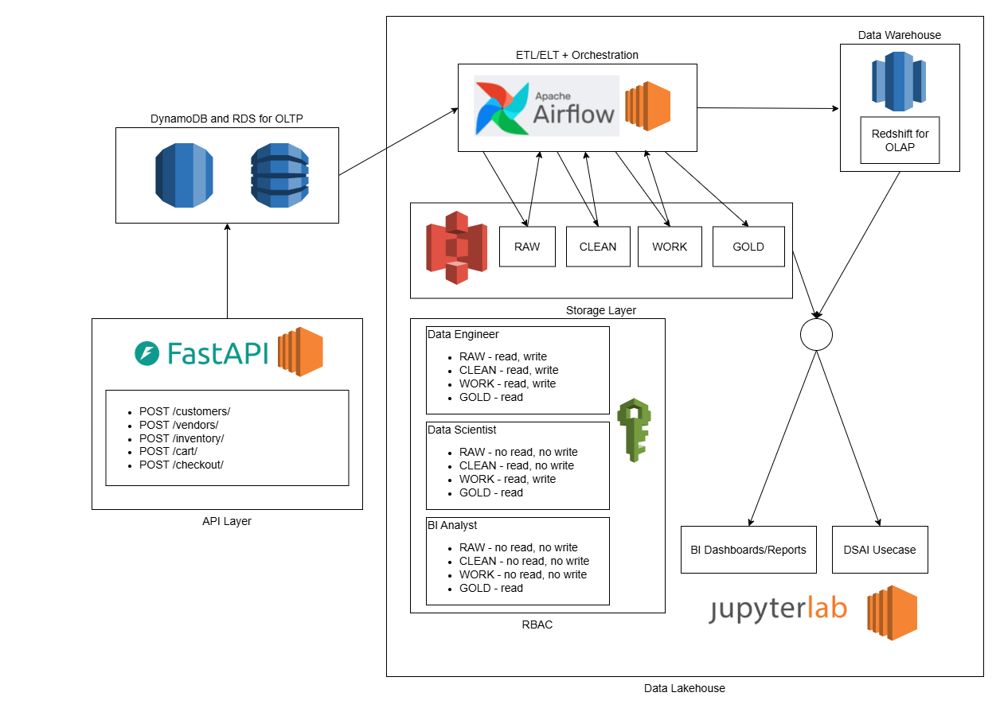
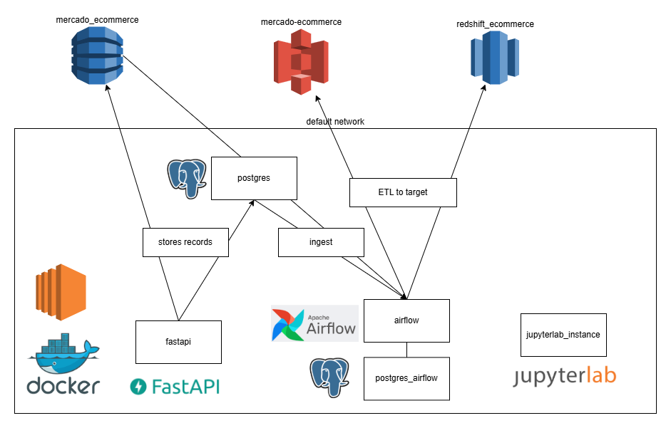

# msds_deds_final_project
## Architecture Overview
### End to end system architecture:


The end to end solution will include:
- API interfaces for data upload 
- OLTP processing (DynamoDB+Postgres)
- Orchestration and ETL/ELT
- Data Lakehouse
- Storage Layers
- RBAC (Role Based Access Control)
- OLTP Data Warehouse
- Consumption

### Docker Architecture:


Services are deployed via Docker in the EC2 instance for ease of deployment and easy to spin up and tear down.
- Postgres for OLTP - Instead of using RDS for postgres we will just use a postgres contained inside our docker network
- Airflow + Postgres - Orchestration and workflow
- Jupyterlab container - to run inserts, and provide DSAI use case in consumption.

### Directory Structure
- `src` - source codes
    - `airflow` - airflow source codes
    - `api` - fastapi source codes                           
    - `dockerfiles` - Dockerfile definition for the services
    - `jupyterlab` - Notebooks and Images
    - `sql` - sql references for create tables
- `.github/workflows` - pre-commit hooks via github actions
- `sample_env` - sample env file to be filled up in an actual `.env file`, should specify details about connection details, and aws access keys.
- `.pre-commit-config.yaml` - pre-commit dependencies
- `docker-compose.yml` - docker compose definitions

## Read PDF Report and Notebook
[View Notebook](src/jupyterlab/notebooks/LT3_FINAL_PROJECT_REPORT.ipynb) \
[View HTML Report](src/jupyterlab/notebooks/LT3_FINAL_PROJECT_REPORT.html) \
[View PDF Report](src/jupyterlab/notebooks/LT3_FINAL_PROJECT_REPORT.pdf)

## Spin up docker containers
- Spin up
```commandline
docker compose --env-file <sample_env/env file> up --build -d
```
- Tear down
```commandline
docker compose down
```